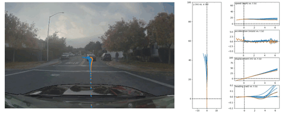

# Alpasim: a lightweight and data-driven research simulator!

  

## Getting started

To run simulations locally (Docker Compose, single machine), see [User docs](docs/TUTORIAL.md). For cluster or SLURM deployment, use your site's job submission and container workflow; the repo provides a helper under `src/tools/run-on-slurm`.

## Content
* [Onboarding](docs/ONBOARDING.md) — Setup (Hugging Face, uv, Docker, CUDA) before running the tutorial
* [Tutorial](docs/TUTORIAL.md)
* [Manual driver](docs/MANUAL_DRIVER.md) — Interactive keyboard control of the ego vehicle
* [Operations guide](docs/OPERATIONS.md) — performance tuning, viewing results and metrics
* [Data pipeline](docs/DATA_PIPELINE.md) — ASL log format and reading logs
* [Changelog](CHANGELOG.md)
* [Plugin system](docs/PLUGIN_SYSTEM.md)
* [System design docs](docs/DESIGN.md)
* [Contributing docs](CONTRIBUTING.md)
* [Developer quick reference](AGENTS.md) — uv, protos, local run, and PR workflow
* [Test suites & scenes](data/scenes/README.md)
* Individual microservices (ego policy, neural rendering, traffic sim, physics, KPI, etc.) are developed in separate repositories; see [design docs](docs/DESIGN.md) for architecture and references.
