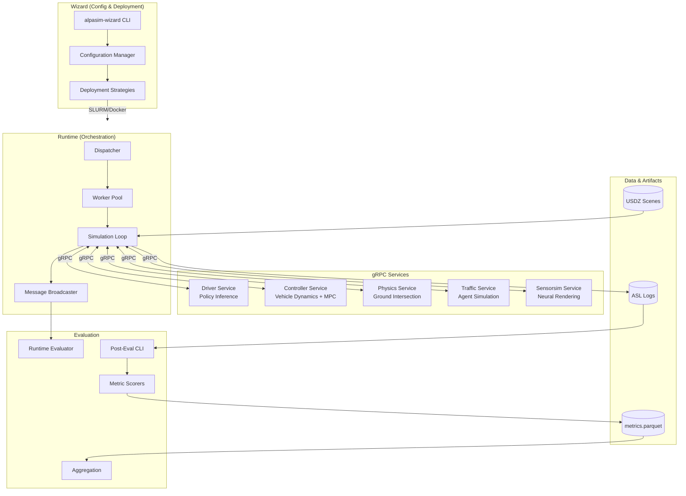
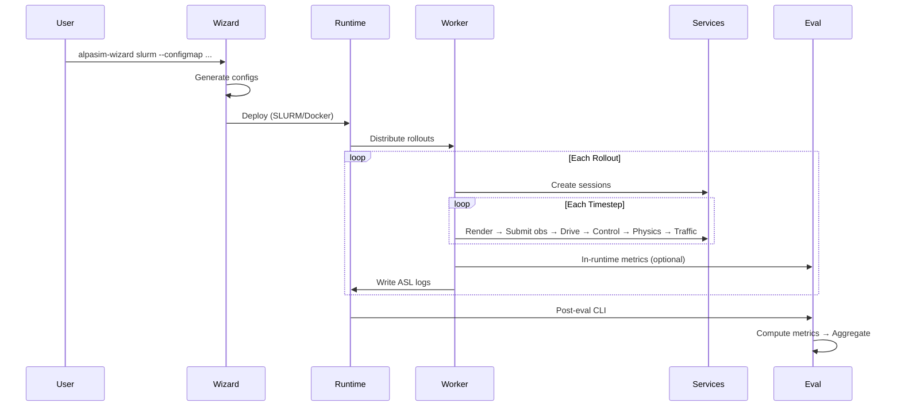
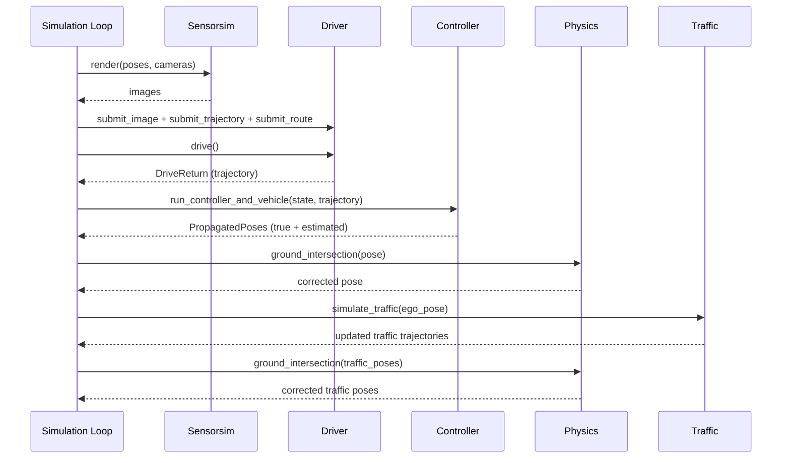
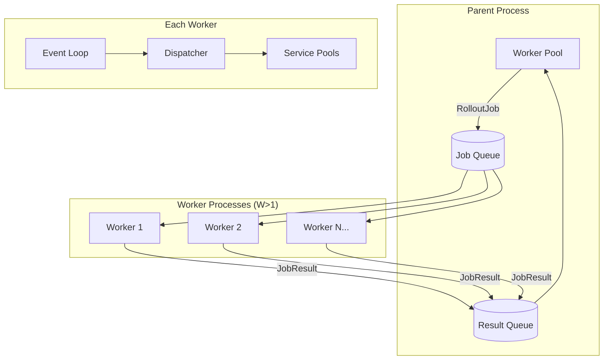

# Codebase Map

> Generated with assistance from [Cartographer](https://github.com/kingbootoshi/cartographer). Last mapped: 2026-02-04
> **For AI agents**: If you find discrepancies between this documentation and the actual code, please surface them to the user rather than silently working around them.

## System Overview

Alpasim is a microservice-based autonomous vehicle simulator. **Runtime** orchestrates simulation rollouts by coordinating gRPC services (Driver, Controller, Physics, Traffic, Sensorsim). **Wizard** generates configurations and deployment artifacts. **Eval** computes metrics from ASL logs and runtime data.



## Directory Structure

```text
src/
├── runtime/          # Orchestrator: workers, service clients, simulation loop
├── grpc/             # Protobuf APIs (.proto) and generated stubs
├── utils/            # Shared: trajectories, artifacts, logging, geometry
├── physics/          # Ground intersection via Warp GPU raycasting
├── controller/       # Vehicle dynamics + MPC (linear/nonlinear)
├── driver/           # Policy inference: VAM, Transfuser, AR1, Manual
├── wizard/           # Config generation and SLURM/Docker deployment
├── eval/             # Metrics: scorers, aggregation, video generation
├── tools/            # ASL conversion, data generation, map utils
├── ddb/              # Placeholder (lockfile only)
└── avmf/             # Placeholder (lockfile only)

docs/                 # Onboarding, design, tutorials
data/                 # Sample assets, scene CSVs, rollouts
tools/                # Dev scripts (precommit)
cicd/                 # GitLab pipeline, Dockerfiles, build scripts
```

---

## Data Flow

### Complete Simulation Flow



### Single Simulation Step



### Worker Parallelism

Runtime parallelism is layered: multiple worker **processes** execute rollouts in parallel, **async tasks** run concurrently within each worker, and service calls are **awaited concurrently** within a rollout step.



**Key concepts**:
- `nr_workers=1`: Inline mode (single process, good for debugging)
- `nr_workers>1`: Subprocess mode with queue-based job distribution
- Each worker's concurrency = minimum pool size across all service types
- Service pools are per-worker; total capacity divided at startup

For detailed documentation on parallelism levels, service capacity configuration, and worker allocation, see [RUNTIME_PARALLELISM.md](RUNTIME_PARALLELISM.md).

---

## Coordinate Frames

| Frame | Origin | Axes | Used By |
|-------|--------|------|---------|
| **DS Rig** | Mid bottom rear bbox edge | X forward, Y left, Z up | Driver service |
| **AABB Center** | Bounding box center | X forward, Y left, Z up | Physics, Traffic |
| **Local/ENU** | Scene origin | East, North, Up | Trajectories, Maps |
| **CG** | Vehicle center of gravity | X forward, Y left | Controller (internal) |

Transform utilities: `get_ds_rig_to_aabb_center_transform()`, `QVec.inverse()`, `Trajectory.transform()`

---

## Conventions

- **gRPC**: Async stubs, session-based APIs, context managers for lifecycle
- **Configs**: OmegaConf YAML, wizard generates `generated-*.yaml`
- **Timestamps**: Microseconds (`*_us`) throughout
- **Logging**: Length-delimited protobuf streams (`.asl` files)
- **Naming**: `pose_<from>_to_<to>` for transforms (e.g., `pose_local_to_rig`)
- **Tests**: Colocated in `src/<module>/tests/`, run with `uv run pytest`

---

## Gotchas

### Environment & Setup
- Protos must be recompiled after changes: `cd src/grpc && uv run compile-protos`
- Required env var: `ALPAMAYO_S3_SECRET` for S3/SwiftStack access

### Runtime
- `nr_workers=1` is inline mode (single process); `>1` uses subprocess parallelism
- Orphan detection only in subprocess mode (W>1)
- Skip mode returns synthetic data but maintains API compatibility
- `group_render_requests` aggregated rendering is not tested internally

### Services
- Physics workaround: only updates Z and rotation (lateral drift prevention)
- ManualModel GUI must run on main thread (macOS requirement)
- Controller model switching at 5 m/s (kinematic ↔ dynamic)

### Wizard & Deployment
- SLURM uses `.sqsh` container images (ORD-specific)
- Config keys use underscores instead of dots (Hydra limitation)
- SLURM array jobs split scenarios via `SLURM_ARRAY_TASK_ID`

### Eval
- Post-eval requires `_complete` marker files
- Uses `forkserver` start method for matplotlib compatibility
- Scorer exceptions don't propagate (isolated error handling)

---

## Navigation Guide

| Task | Files to Modify |
|------|-----------------|
| **Add a new gRPC service** | `src/grpc/v0/*.proto`, `src/runtime/services/`, `src/wizard/services.py`, `cicd/gitlab/definitions.yml` |
| **Add a runtime feature** | `src/runtime/alpasim_runtime/`, `src/runtime/alpasim_runtime/config.py` |
| **Add a new metric** | `src/eval/scorers/`, `src/eval/schema.py`, `src/eval/aggregation/modifiers.py` |
| **Add a driver model** | `src/driver/models/`, `src/driver/schema.py`, `src/driver/main.py` |
| **Add MPC implementation** | `src/controller/mpc_impl/`, `src/controller/mpc_controller.py` |
| **Add wizard config group** | `src/wizard/configs/<group>/`, `src/wizard/configs/base_config.yaml` |
| **Add deployment strategy** | `src/wizard/deployment/`, `src/wizard/wizard.py` |
| **Add scene management CLI** | `src/wizard/scenes/cli/` |

---

## External Dependencies

| Repository | Purpose |
|------------|---------|
| [alpamayo](https://gitlab-master.nvidia.com/alpamayo/alpamayo) | Alpamayo policy models |
| [NRE](https://gitlab-master.nvidia.com/Toronto_DL_Lab/nre) | Neural rendering engine |
| [trafficsim](https://gitlab-master.nvidia.com/alpamayo/trafficsim) | Traffic simulation |

---

## Running Simulations Locally

See [RUNNING_LOCALLY.md](RUNNING_LOCALLY.md) for detailed instructions on running and debugging simulations on a local workstation, including Docker Compose deployment, hybrid debugging, and VSCode integration.

---

## Module Guide

Detailed reference documentation for each module.

### Runtime (`src/runtime/`)

**Purpose**: Central orchestrator that runs simulation rollouts, manages service connections, coordinates workers, and logs data.

**Entry points**:
- `alpasim_runtime/simulate/__main__.py` - CLI entry point
- `alpasim_runtime/worker/pool.py::run_workers()` - Worker orchestration

**Architecture**:
- **Dispatcher** (`dispatcher.py`): Manages service pools, assigns rollouts to available services
- **Worker Pool** (`worker/pool.py`): Parallel execution with subprocess workers (W>1) or inline (W=1)
- **Simulation Loop** (`loop.py`): Two-phase initialization → execution
  - `UnboundRollout`: Pre-execution validation and config binding
  - `BoundRollout`: Execution-ready rollout with service bindings

| File | Purpose |
|------|---------|
| `loop.py` | Main simulation loop, `UnboundRollout`/`BoundRollout` classes |
| `dispatcher.py` | Service pool coordination, atomic service acquisition |
| `config.py` | OmegaConf configuration schema (`SimulatorConfig`) |
| `types.py` | Clock, triggers, camera definitions |
| `broadcaster.py` | Message broadcasting to handlers (logging, eval) |
| `camera_catalog.py` | Camera definition catalog with override support |
| `services/service_base.py` | Generic base class for service wrappers |
| `services/service_pool.py` | Queue-based service pool management |
| `services/driver_service.py` | Driver/policy service wrapper |
| `services/controller_service.py` | Controller/vehicle model wrapper |
| `services/physics_service.py` | Physics ground intersection wrapper |
| `services/sensorsim_service.py` | Sensor simulation (rendering) wrapper |
| `services/traffic_service.py` | Traffic simulation wrapper |
| `worker/pool.py` | Worker pool orchestration (subprocess/inline modes) |
| `worker/allocation.py` | Service instance distribution across workers |
| `worker/ipc.py` | IPC message types and queue polling |
| `worker/main.py` | Worker process entry point |
| `telemetry/` | Prometheus metrics, RPC profiling, resource sampling |
| `replay_services/` | ASL replay services for testing |

**Exports**: `UnboundRollout`, `BoundRollout`, `Dispatcher`, `ServicePool`, `run_workers`

**Key patterns**:
- Two-phase initialization: validation then execution
- Context managers for service lifecycle
- Queue-based worker parallelism with atomic service acquisition
- Message broadcasting for logging and evaluation

**Gotchas**:
- Coordinate frames: DS rig ↔ AABB center transforms required
- `force_gt_period`: Forces ground truth during initial simulation period
- Hidden traffic objects lowered below ground to avoid NRE artifacts
- Warmup render before main loop to avoid cold-start skew
- Only worker 0 samples CPU/GPU resources to avoid overhead

---

### Wizard (`src/wizard/`)

**Purpose**: Generates service configurations and orchestrates deployments via SLURM or Docker Compose.

**Entry point**: `alpasim_wizard/__main__.py` (Hydra CLI)

**Architecture**:
- **Wizard** (`wizard.py`): Main orchestrator
- **Configuration Manager** (`configuration.py`): Generates all service configs
- **Deployment Strategies** (`deployment/`): Docker Compose and SLURM deployers
- **Scene Management** (`scenes/`): USDZ artifact querying and download

| File | Purpose |
|------|---------|
| `wizard.py` | Main `AlpasimWizard` class, deployment orchestration |
| `configuration.py` | Config generation for all services |
| `context.py` | `WizardContext`: config + runtime state |
| `schema.py` | Type-safe config schema (dataclasses) |
| `services.py` | Container/service definitions, GPU assignment |
| `deployment/docker_compose.py` | Docker Compose file generation |
| `deployment/slurm.py` | SLURM job submission and monitoring |
| `deployment/dispatcher.py` | Command execution with logging |
| `scenes/sceneset.py` | `USDZManager`: artifact querying and download |
| `scenes/csv_utils.py` | Scene/suite CSV operations |
| `scenes/cli/` | CLI tools: car2sim, migrate, populate, validate |
| `s3_api.py` | S3/SwiftStack API wrapper |
| `setup_omegaconf.py` | Hydra/OmegaConf setup and validation |
| `configs/base_config.yaml` | Base configuration template |

**Exports**: `AlpasimWizard`, `ConfigurationManager`, `WizardContext`, `USDZManager`

**Key patterns**:
- Hydra/OmegaConf for layered configuration
- Strategy pattern for deployments (Docker vs SLURM)
- Factory pattern for container creation
- Symlink-based sceneset caching with MD5 hashing

**Gotchas**:
- Config key `artifact_compatibility_matrix` uses underscores (Hydra limitation)
- SLURM array jobs use `SLURM_ARRAY_TASK_ID` for scenario splitting
- Port assigner finds next available port via socket checking
- `.sqsh` files required for SLURM container images (ORD-specific)

---

### Driver (`src/driver/`)

**Purpose**: Policy inference service supporting multiple model backends (VAM, Transfuser, AR1, Manual).

**Entry point**: `alpasim_driver/main.py`

| File | Purpose |
|------|---------|
| `main.py` | gRPC service, session management, worker thread |
| `schema.py` | Configuration schema (`DriverConfig`, `ModelConfig`) |
| `frame_cache.py` | Thread-safe frame buffer with subsampling |
| `navigation.py` | Route analysis for driving commands |
| `rectification.py` | F-theta → pinhole camera rectification |
| `trajectory_optimizer.py` | Smoothness and comfort post-processing |
| `models/base.py` | Abstract `BaseTrajectoryModel` interface |
| `models/ar1_model.py` | Alpamayo-R1 vision-language model |
| `models/vam_model.py` | VAM (Video Action Model) with tokenization |
| `models/transfuser_model.py` | Transfuser multi-camera model |
| `models/manual_model.py` | Human-controlled pygame GUI |

**Exports**: `EgoDriverService`, `BaseTrajectoryModel`, model implementations

**Key patterns**:
- Worker thread pattern: background thread batches inference jobs
- Factory pattern for model selection
- Frame subsampling for temporal context

**Gotchas**:
- ManualModel GUI must run on main thread (macOS Cocoa requirement)
- Trajectories in rig frame (X forward, Y left)
- Rectifier built lazily on first image (needs actual resolution)
- VAM uses float16, AR1 uses bfloat16

---

### Controller (`src/controller/`)

**Purpose**: Vehicle dynamics simulation and MPC-based trajectory tracking.

**Entry point**: `alpasim_controller/server.py`

| File | Purpose |
|------|---------|
| `server.py` | gRPC service entry point |
| `mpc_controller.py` | Abstract MPC interface, shared dataclasses |
| `system.py` | Combined dynamics + MPC system |
| `system_manager.py` | Session and system management |
| `vehicle_model.py` | Planar dynamic bicycle model |
| `mpc_impl/linear_mpc.py` | OSQP-based linear MPC |
| `mpc_impl/nonlinear_mpc.py` | CasADi/IPOPT nonlinear MPC |
| `benchmark/` | Performance benchmarking tools |

**Exports**: `System`, `VehicleModel`, `MPCController`, `LinearMPC`, `NonlinearMPC`

**Key patterns**:
- Strategy pattern: MPC implementation selected at runtime
- Condensed QP formulation for linear MPC
- Runge-Kutta integration with sub-stepping

**Gotchas**:
- Velocity at CG (not rig origin) - conversion needed
- Model switching: kinematic below 5 m/s, dynamic above
- `DT_MPC = 0.1s`, `N_HORIZON = 20` (2s lookahead)
- IPOPT limited to 30 iterations for speed

---

### Physics (`src/physics/`)

**Purpose**: Ground intersection correction using GPU-accelerated mesh raycasting.

**Entry point**: `alpasim_physics/server.py`

| File | Purpose |
|------|---------|
| `backend.py` | Warp-based raycasting, plane fitting |
| `server.py` | gRPC service implementation |
| `utils.py` | Pose/AABB conversions |
| `client.py` | Gradio testing UI |

**Exports**: `PhysicsBackend`, `PhysicsSimService`

**Key patterns**:
- GPU-accelerated raycasting via NVIDIA Warp
- LRU cache for scene backends
- Plane fitting to intersection points

**Gotchas**:
- Only Z position and rotation updated (lateral drift prevention workaround)
- Raises exceptions for high translation/rotation errors
- Visualization requires optional `polyscope` dependency

---

### Eval (`src/eval/`)

**Purpose**: Post-simulation evaluation: reads ASL logs, computes metrics, generates videos.

**Entry points**:
- `eval/main.py` - Post-eval CLI
- `eval/runtime_evaluator.py` - In-runtime evaluation
- `eval/aggregation/main.py` - Aggregation CLI

| File | Purpose |
|------|---------|
| `main.py` | Post-eval entry point, multiprocessing |
| `data.py` | Core data structures (`SimulationResult`, cameras, polygons) |
| `accumulator.py` | Unified message accumulation from logs |
| `runtime_evaluator.py` | In-runtime evaluation handler |
| `scenario_evaluator.py` | Evaluation pipeline orchestration |
| `asl_loader.py` | ASL file loading utilities |
| `scorers/base.py` | Abstract scorer interface |
| `scorers/collision.py` | Collision detection metrics |
| `scorers/offroad.py` | Offroad/wrong-lane metrics |
| `scorers/minADE.py` | Minimum Average Displacement Error |
| `aggregation/main.py` | Aggregation entry point |
| `aggregation/processing.py` | Multi-stage aggregation pipeline |
| `aggregation/modifiers.py` | Chainable data transformations |
| `video.py` | Video rendering from eval results |

**Exports**: `ScenarioEvaluator`, `ScenarioEvalResult`, `RuntimeEvaluator`, `EvalDataAccumulator`

**Key patterns**:
- Two-stage data flow: `ScenarioEvalInput` (raw) → `SimulationResult` (processed)
- Scorer group pattern with error isolation
- Multi-stage aggregation: time → clips → rollouts

**Gotchas**:
- Requires `_complete` marker files for post-eval
- Uses `forkserver` for matplotlib compatibility
- Scorers catch exceptions internally (don't propagate)
- SLURM array job synchronization via file counter

---

### gRPC (`src/grpc/`)

**Purpose**: Protobuf definitions and generated stubs for inter-service communication.

**Entry point**: `scripts/compile_protos.py`

| File | Purpose |
|------|---------|
| `v0/common.proto` | Shared types: `Pose`, `Trajectory`, `AABB`, `DynamicState` |
| `v0/controller.proto` | VDC service API |
| `v0/egodriver.proto` | Driver/policy service API |
| `v0/physics.proto` | Physics service API |
| `v0/sensorsim.proto` | Sensor simulation API |
| `v0/traffic.proto` | Traffic service API |
| `v0/runtime.proto` | Runtime orchestration API |
| `v0/logging.proto` | ASL logging message types |

**Exports**: `*_pb2.py`, `*_pb2_grpc.py` (generated)

**Gotchas**:
- Must recompile after `.proto` changes: `cd src/grpc && uv run compile-protos`
- Sensorsim proto namespaced for NRE compatibility
- Quaternion format varies: scipy uses `[x,y,z,w]`, proto uses `[w,x,y,z]`
- Timestamps are microseconds (`fixed64`)

---

### Utils (`src/utils/`)

**Purpose**: Shared data structures, artifact loading, and log I/O.

| File | Purpose |
|------|---------|
| `artifact.py` | USDZ artifact loading (scenes, trajectories, maps) |
| `trajectory.py` | `Trajectory` class with interpolation and derivatives |
| `qvec.py` | `QVec`: quaternion + translation SE(3) operations |
| `polyline.py` | 2D/3D polyline geometry (projection, resampling) |
| `logs.py` | ASL log reading/writing (length-delimited protobuf) |
| `scenario.py` | `Rig`, `TrafficObjects`, `VehicleConfig` |
| `paths.py` | Rollout path parsing utilities |
| `types.py` | Shared types (`ImageWithMetadata`) |
| `asl_to_frames/` | ASL to frame extraction CLI |
| `print_asl/` | ASL inspection CLI |

**Exports**: `Artifact`, `Trajectory`, `QVec`, `Polyline`, `LogWriter`, `Rig`, `TrafficObjects`

**Gotchas**:
- Quaternion format: scipy `[x,y,z,w]` (not `[w,x,y,z]`)
- `Trajectory.interpolate_to_timestamps()` uses SLERP for rotations
- Artifact map loading tries clipgt/map_data first, falls back to XODR

---

### Tools (`src/tools/`)

**Purpose**: Utility scripts and CLIs for data conversion and dev workflows.

| Directory | Purpose |
|-----------|---------|
| `asl_to_roadcast/` | Convert ASL logs to Roadcast format |
| `data_generation/` | Dataset extraction and CATK pipeline automation |
| `map_utils/` | Map visualization and debugging |
| `mock-driver/` | Simple mock driver for testing |
| `run-on-ord/` | SLURM job submission scripts |
| `scripts/` | Misc utilities (query suites TUI, camera conversion) |
