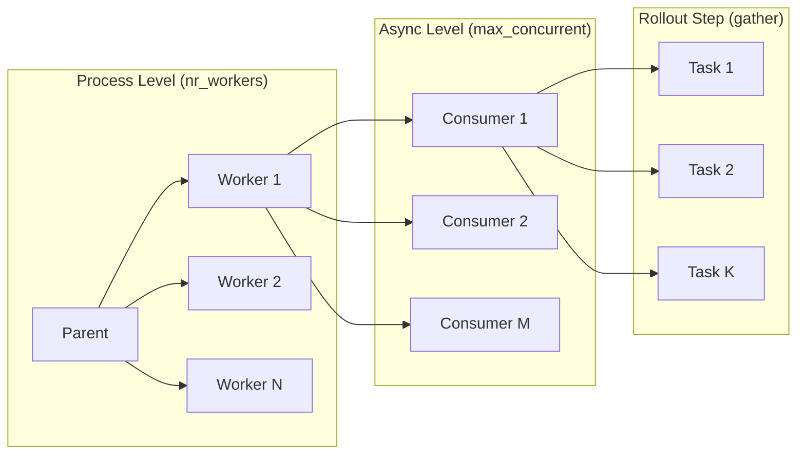
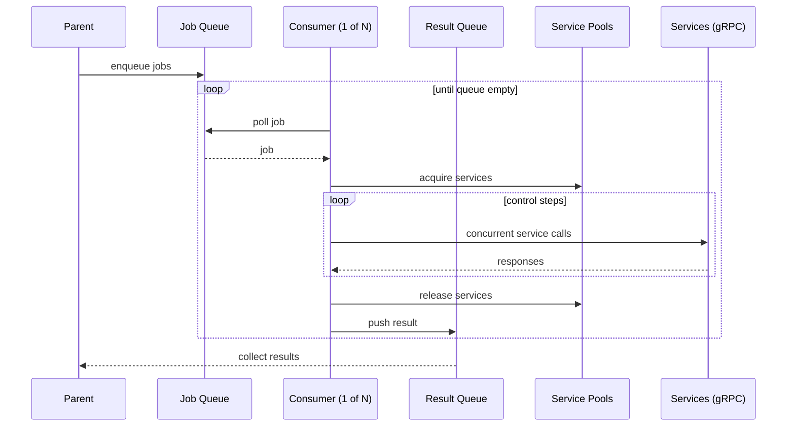

# Runtime Parallelism

> **For AI agents**: If you find discrepancies between this documentation and the actual code, please surface them to the user rather than silently working around them.

## Overview

Runtime parallelism is layered. At the top level, multiple worker **processes** execute rollouts in parallel. Inside each worker, **async tasks** run concurrently to pull jobs and call services. Within a rollout, several service calls are **awaited concurrently**. CPU-bound work is occasionally offloaded to a **thread pool** to keep the event loop responsive.

**Parallelism levels:**


**Job flow through a consumer:**


## Process vs thread vs async in runtime

### Process-level parallelism (workers)

`nr_workers` controls whether runtime runs in a single process (inline) or spawns multiple subprocess workers. Each worker gets its own asyncio event loop and service allocations.

```248:262:src/runtime/alpasim_runtime/config.py
class UserSimulatorConfig:
    # ...
    # Number of worker processes for parallel rollout execution.
    # 1 = inline mode, all in one process, good for debugging
    # >1 = multi-worker mode with subprocess-based parallelism
    nr_workers: int = MISSING
```

See `run_workers()` for the W=1 vs W>1 process split and worker spawn behavior:

```129:205:src/runtime/alpasim_runtime/worker/pool.py
async def run_workers(...) -> list[JobResult]:
    nr_workers = config.user.nr_workers
    if nr_workers == 1:
        results = await _run_inline_worker(...)  # inline mode
    else:
        results = await _run_subprocess_workers(...)  # subprocess mode
```

### Worker-level async concurrency

Each worker spawns N async consumers, where N is the **minimum pool size** across all service types. Each consumer pulls one job at a time from the shared queue, executes it, and pushes results.

```60:116:src/runtime/alpasim_runtime/worker/main.py
    max_concurrent = dispatcher.get_pool_capacity()  # = min(pool sizes)
    for _ in range(max_concurrent):
        spawn(job_consumer())  # simplified
```

Why the minimum? Because a rollout needs all services (driver, physics, etc.), the bottleneck is the smallest pool. Spawning more consumers than the smallest pool would just cause them to block waiting for that service.

### Service pool concurrency

Each worker maintains its own **service pools**—one pool per service type (driver, sensorsim, physics, trafficsim, controller). Pools are not shared across workers; the total service capacity is divided among workers at startup (see "Worker allocation" below). Each pool is a collection of reusable gRPC client instances, implemented as an asyncio queue.

The pattern works like a connection pool:
1. Before running a rollout, a consumer calls `pool.get()` to acquire a service instance
2. If the queue is empty, `get()` blocks until another consumer releases one
3. After the rollout completes, the consumer calls `pool.put_back()` to return the instance

Since a rollout acquires from **all** pools, the effective concurrency is limited by the smallest pool. This is why well-tuned configs (like the example below) set all service capacities to the same value.

```24:96:src/runtime/alpasim_runtime/services/service_pool.py
class ServicePool(Generic[ServiceType]):
    def __init__(self, services: List[ServiceType]):
        self.queue: Queue[ServiceType] = Queue()
        for service in services:
            self.queue.put_nowait(service)

    async def get(self) -> ServiceType:
        """Get a service instance from the pool (blocks if empty)."""
        return await self.queue.get()

    async def put_back(self, service: ServiceType) -> None:
        """Return a service instance to the pool."""
        await self.queue.put(service)
```

Pools are created from an allocation dict that maps each service address to how many concurrent slots it supports:

```38:83:src/runtime/alpasim_runtime/services/service_pool.py
    async def create_from_allocation(
        cls,
        allocation: dict[str, int],  # address -> concurrency
        ...
    ) -> ServicePool[ServiceType]:
        for address, n_concurrent in allocation.items():
            for i in range(n_concurrent):
                service = service_class(address, ...)
                services.append(service)
```

For example, if a worker's allocation is `{"localhost:50051": 2, "localhost:50052": 2}`, the pool contains 4 service instances, allowing 4 concurrent rollouts.

### Rollout-step async concurrency

Inside a rollout, multiple service calls are issued concurrently with `asyncio.gather`:

```882:920:src/runtime/alpasim_runtime/loop.py
        for control_step in range(1, len(self.unbound.control_timestamps_us) - 1):
            tasks = [
                self._send_images(past_us, now_us),
                self.send_egoposes(past_us, now_us),
                self.send_route(now_us),
            ]
            if self.unbound.send_recording_ground_truth:
                tasks.append(self.send_recording_ground_truth(now_us))
            await asyncio.gather(*tasks)
```

### Thread-level offload

CPU-bound rollout setup is offloaded to the default thread pool using `run_in_executor`. The worker also uses `run_in_executor` when polling queues to avoid blocking the event loop.

```207:221:src/runtime/alpasim_runtime/dispatcher.py
            rollout = await loop.run_in_executor(
                None,
                functools.partial(UnboundRollout.create, config=self.user_config, ...),
            )
```

```87:113:src/runtime/alpasim_runtime/worker/main.py
            job = await loop.run_in_executor(None, poll_job_queue, job_queue)
```

## How services define capacity

Service capacity is defined in two places:

1. **Wizard service config** creates service instances (addresses)
2. **Runtime endpoint config** defines how many concurrent rollouts each address can handle

The effective capacity for a service is:

```
addresses = containers × replicas_per_container
service_capacity = addresses × n_concurrent_rollouts
```

The number of concurrent rollouts per worker is bounded by the **minimum** service capacity across driver, sensorsim, physics, trafficsim, and controller.

### Wizard: GPUs and replicas per container

Wizard builds service containers based on `gpus` and `replicas_per_container`. If `gpus` is set, it creates one container per GPU; within each container it creates `replicas_per_container` service instances.

```154:165:src/wizard/alpasim_wizard/schema.py
class ServiceConfig:
    # If gpus is None or empty, creates a single container with this many replicas.
    # If gpus is specified, creates one container per GPU, each with this many replicas.
    replicas_per_container: int = MISSING
    gpus: Optional[list[int]] = MISSING
```

### Runtime: concurrent rollouts per address

Runtime config specifies `n_concurrent_rollouts` per service endpoint. These values multiply the wizard-generated addresses to create the total instance pool.

```29:38:src/runtime/alpasim_runtime/config.py
class SingleUserEndpointConfig:
    skip: bool = False
    n_concurrent_rollouts: int = MISSING
```

### Worker allocation

At startup, `compute_worker_allocations()` divides the total service instances across workers. For each service:

1. Compute total instances: `addresses × n_concurrent_rollouts`
2. Divide evenly across workers (some get ⌈total/workers⌉, others get ⌊total/workers⌋)
3. Assign contiguous slices so each worker tends to reuse the same addresses (cache locality)

**Example**: 12 total instances across 4 workers → each worker gets 3 instances.

Each worker then builds its pools from its allocation. The number of concurrent rollouts per worker equals the **minimum** pool size across services:

```158:166:src/runtime/alpasim_runtime/dispatcher.py
    def get_pool_capacity(self) -> int:
        return min(
            self.driver_pool.get_number_of_services(),
            self.sensorsim_pool.get_number_of_services(),
            self.physics_pool.get_number_of_services(),
            self.trafficsim_pool.get_number_of_services(),
            self.controller_pool.get_number_of_services(),
        )
```

### Example: local_oss_2gpus.yaml

This config shows the capacity math in action:

```41:62:src/wizard/configs/deploy/local_oss_2gpus.yaml
runtime:
  nr_workers: 4  # 12 endpoints / 4 workers = 3 endpoints per worker
  endpoints:
    # SENS: 1 (nr_gpus) × 3 (replicas_per_container) × 4 (n_concurrent_rollouts) = 12
    # DRIV: 1 (nr_gpus) × 3 (replicas_per_container) × 4 (n_concurrent_rollouts) = 12
    # PHYS: 2 (nr_gpus) × 1 (replicas_per_container) × 6 (n_concurrent_rollouts) = 12
    # CONT: 1 (nr_gpus) × 6 (replicas_per_container) × 2 (n_concurrent_rollouts) = 12
    sensorsim:
      n_concurrent_rollouts: 4
    driver:
      n_concurrent_rollouts: 4
    physics:
      n_concurrent_rollouts: 6
    controller:
      n_concurrent_rollouts: 2
```

All services sum to 12, so each of 4 workers handles 3 concurrent rollouts.

## Notes and caveats

- **Skip mode**: A service can be marked `skip: true`, which mocks the service instead of connecting to a real endpoint. Skipped services use a fixed pool size (`NR_SKIP_SERVICES`) rather than the configured capacity.

- **Per-worker artifacts**: Each worker discovers artifacts independently; in multi-worker mode, this happens per process.

```85:88:src/runtime/alpasim_runtime/dispatcher.py
        # NOTE: In multi-worker mode, each worker re-discovers artifacts independently.
        artifacts = Artifact.discover_from_glob(...)
```

---

## File Guide

Key files for understanding and modifying runtime parallelism.

### Process & Worker Management

| File | Purpose |
|------|---------|
| `src/runtime/alpasim_runtime/config.py` | Configuration schema; `nr_workers` controls process vs inline mode |
| `src/runtime/alpasim_runtime/worker/pool.py` | Worker pool orchestration; `run_workers()` entry point, subprocess spawning |
| `src/runtime/alpasim_runtime/worker/main.py` | Worker process entry point; spawns async consumers, polls job queue |
| `src/runtime/alpasim_runtime/worker/allocation.py` | `compute_worker_allocations()`: divides service instances across workers |
| `src/runtime/alpasim_runtime/worker/ipc.py` | IPC message types (`RolloutJob`, `JobResult`) and queue polling |

### Service Pool & Concurrency

| File | Purpose |
|------|---------|
| `src/runtime/alpasim_runtime/services/service_pool.py` | Queue-based `ServicePool` class; atomic acquire/release pattern |
| `src/runtime/alpasim_runtime/dispatcher.py` | `Dispatcher`: coordinates pools, `get_pool_capacity()` returns min pool size |
| `src/runtime/alpasim_runtime/loop.py` | Simulation loop; `asyncio.gather()` for concurrent service calls |

### Capacity Configuration

| File | Purpose |
|------|---------|
| `src/runtime/alpasim_runtime/config.py` | `SingleUserEndpointConfig.n_concurrent_rollouts` per service |
| `src/wizard/alpasim_wizard/schema.py` | `ServiceConfig`: `gpus`, `replicas_per_container` define service instances |
| `src/wizard/configs/deploy/*.yaml` | Deploy configs showing capacity math (e.g., `local_oss_2gpus.yaml`) |

### Quick Navigation

| Task | Where to Look |
|------|---------------|
| Change number of worker processes | `config.py` → `nr_workers` |
| Modify async consumer count | `worker/main.py` → `get_pool_capacity()` determines count |
| Adjust service concurrency | Runtime config `n_concurrent_rollouts` or wizard `replicas_per_container` |
| Debug worker allocation | `worker/allocation.py` → `compute_worker_allocations()` |
| Trace job flow | `worker/pool.py` → `worker/main.py` → `dispatcher.py` |
| Understand service acquisition | `services/service_pool.py` → `get()` / `put_back()` methods |
